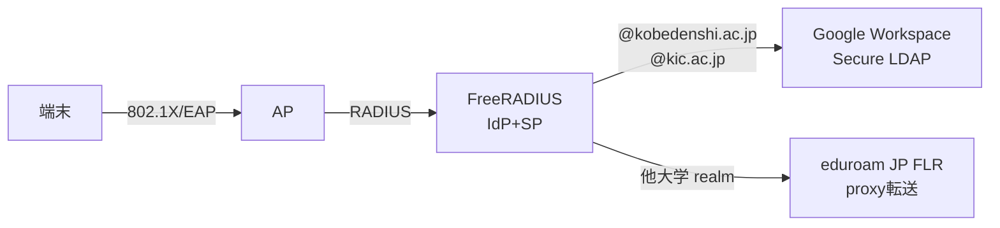

# eduroam技術検証環境

学校法人コンピュータ総合学園（神戸電子専門学校・神戸情報大学院大学）へのeduroam導入に向けた技術検証環境。
FreeRADIUS + Google Workspace Secure LDAPによるEAP-TTLS/PAP認証をDockerで構築する。

## アーキテクチャ



## 認証方式

**EAP-TTLS/PAP** を採用。Google Workspace / Azure ADいずれもNTハッシュを提供できないため、PEAP/MSCHAPv2は使用不可。

## クイックスタート

```bash
# 1. 初期セットアップ（証明書生成、設定ファイル作成）
make setup

# 2. 環境起動
make up

# 3. ログ確認
make logs

# 4. 認証テスト
make test-radtest
```

## 構成

| サービス | 用途 | ポート |
|---------|------|--------|
| freeradius | RADIUSサーバー | 1812/udp, 1813/udp |
| openldap | ローカルテスト用LDAP | 389 |
| test-client | radtest/eapol_testクライアント | - |

## 環境変数の設定

```bash
cp docker/.env.example docker/.env
# docker/.env を編集してパスワード・シークレットを設定
```

テストユーザーのパスワードやRADIUS共有シークレットは `docker/.env` で管理する。

## Makeコマンド

| コマンド | 説明 |
|---------|------|
| `make setup` | 初期セットアップ |
| `make up` | 環境起動 |
| `make down` | 環境停止 |
| `make logs` | FreeRADIUSログ表示 |
| `make test-radtest` | radtestで認証テスト |
| `make test-eapol` | eapol_testでEAP-TTLS/PAP認証テスト |
| `make ldap-search` | LDAPユーザー確認 |
| `make clean` | 全環境クリーンアップ |

## ドキュメント

- [アーキテクチャ設計書](docs/infrastructure/architecture.md) — システム全体像、認証フロー、フェーズ別構成
- [eduroam JP 申請資格調査](docs/application/eligibility.md) — 参加条件と申請ルートの整理
- [APベンダー調査](docs/ap/vendor-survey.md) — 6ベンダー比較、eduroam適性ランク、TCO試算

## 検証フェーズ

1. **Phase 1**: ローカル検証（OpenLDAP） ← 現在のフェーズ
2. **Phase 2**: Google Workspace Secure LDAP接続
3. **Phase 3**: Proxy検証（モックFLR）
4. **Phase 4**: eduroam JP接続（NII登録後）
5. **Phase 5**: AP統合・実機テスト

## ディレクトリ構造

```
eduroam_project/
├── docker/
│   ├── docker-compose.yml
│   ├── .env.example
│   ├── freeradius/          # FreeRADIUS設定
│   ├── openldap/            # テスト用LDAPデータ
│   └── test-client/         # テストクライアント
├── scripts/
│   ├── setup.sh             # 初期セットアップ
│   └── generate-certs.sh    # 証明書生成
├── Makefile
└── README.md
```
