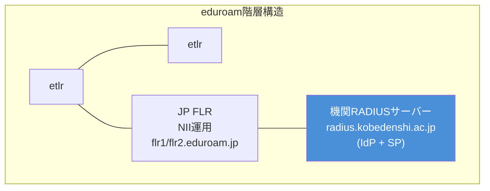
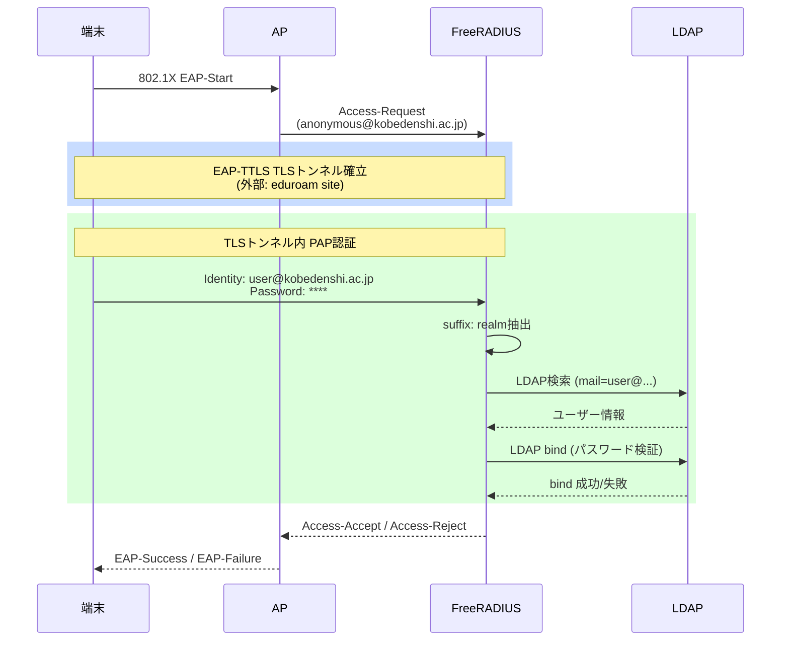
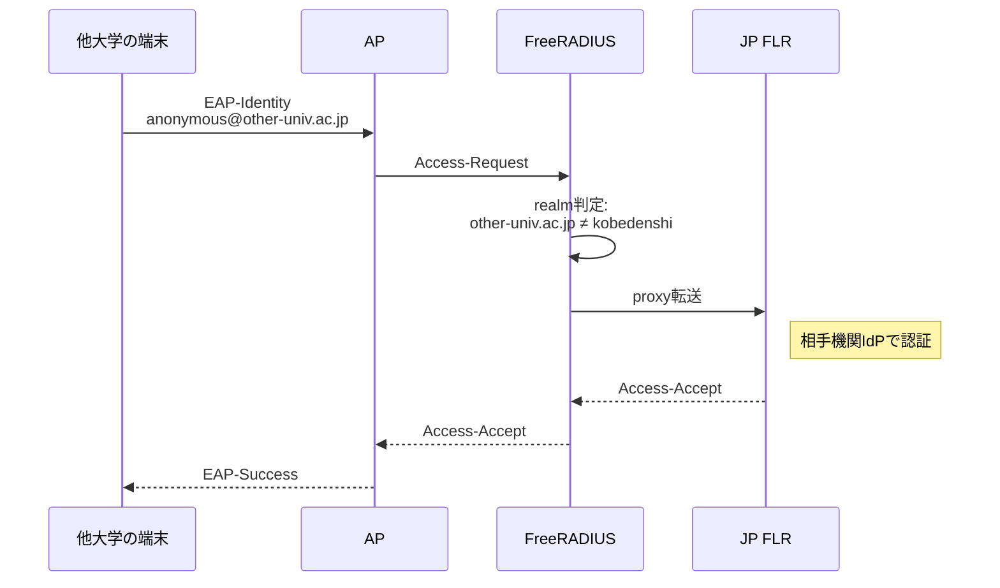
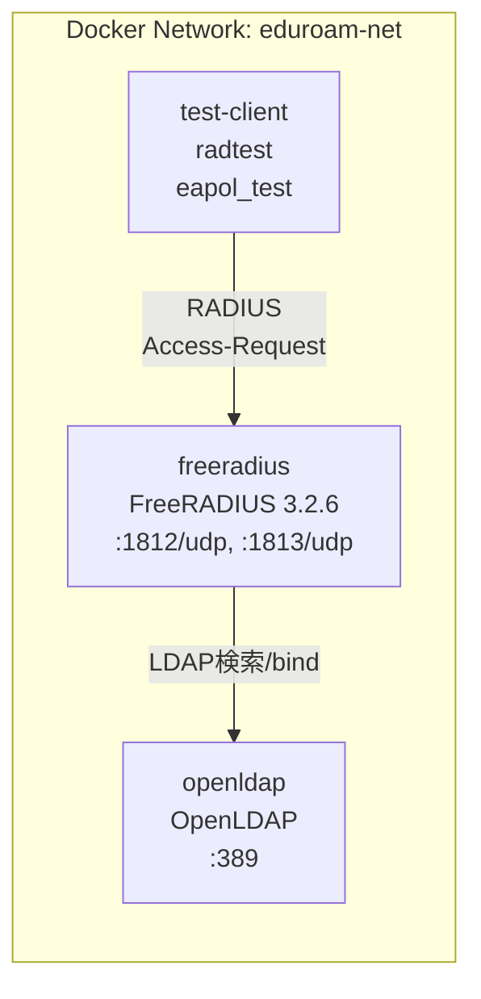
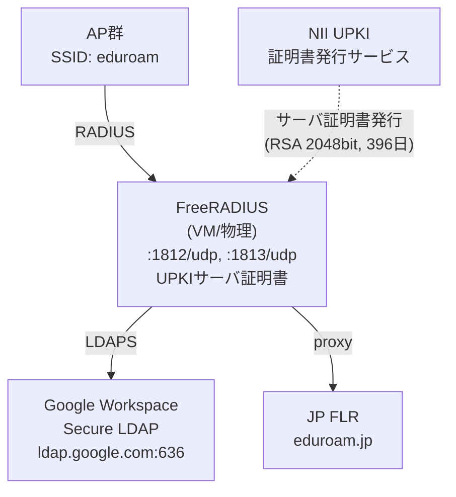
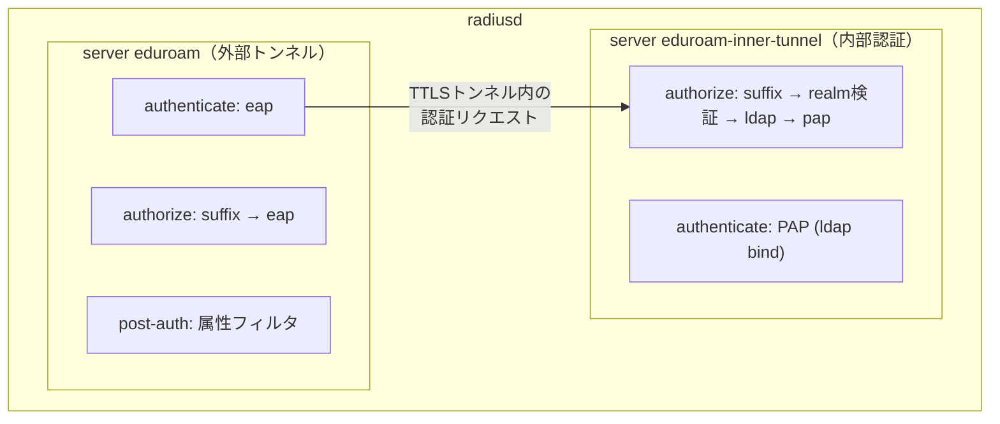
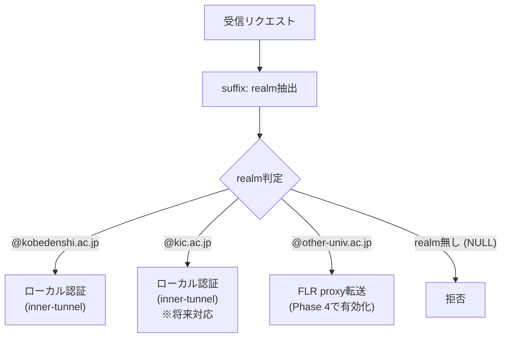
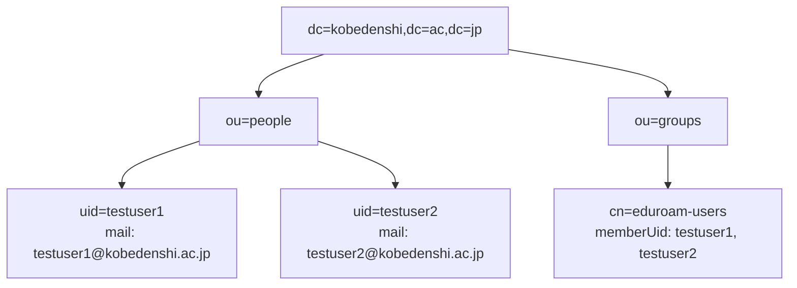
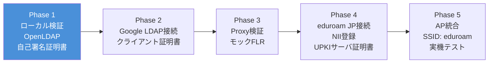

# eduroam技術検証環境 アーキテクチャ設計書

## 1. 概要

神戸電子専門学校（kobedenshi.ac.jp）にeduroamを導入するための技術検証環境。
FreeRADIUS を IdP（Identity Provider）兼 SP（Service Provider）として運用し、Google Workspace Secure LDAP でユーザー認証を行う。

**申請主体**: 学校法人コンピュータ総合学園（神戸情報大学院大学・神戸電子専門学校を設置）
**UPKI利用資格根拠**: NII UPKI電子証明書発行サービス利用規程 第2条第2号（大学を設置する学校法人）

### 1.1 DNS調査結果（2026-03-16確認）

両ドメインの主要DNSレコードを調査し、以下を確認した。

| 項目 | kic.ac.jp | kobedenshi.ac.jp |
|------|-----------|------------------|
| MX | `aspmx.l.google.com`（pri 1）他Google系 | `aspmx.l.google.com`（pri 1）他Google系 |
| SPF | `include:_spf.google.com` | `include:gmail.com` |
| NS | 01〜04.dnsv.jp | 01〜04.dnsv.jp |

**確認事項**:
- **両ドメインともGoogle Workspace運用済み**: MXレコード・SPFレコードから確認。Google Workspace Secure LDAPによる認証方式は両ドメインのユーザーに対して適用可能
- **DNS事業者が共通（dnsv.jp）**: UPKIドメイン審査でDNS TXTレコード認証を選択する場合、同一の管理画面から両ドメインのTXTレコードを追加できる

## 2. eduroam階層構造における位置づけ

**IdP（Identity Provider）**: 自機関ユーザー（@kobedenshi.ac.jp）の認証を担当
**SP（Service Provider）**: 他機関ユーザーのリクエストをFLRへ転送

## 3. 認証フロー

### 3.1 自機関ユーザーの認証（IdP）

### 3.2 他機関ユーザーの認証（SP → FLR転送）

## 4. 認証方式: EAP-TTLS/PAP

### 4.1 選定理由

| 要素 | EAP-TTLS/PAP | PEAP/MSCHAPv2 |
|------|-------------|---------------|
| Google Workspace LDAP | **対応** (LDAP bind) | 非対応 (NTハッシュ不可) |
| Azure AD | **対応** (ROPC等) | 非対応 (NTハッシュ不可) |
| Windows | Win8+で対応 | ネイティブ対応 |
| macOS/iOS/Android | ネイティブ対応 | ネイティブ対応 |

Google Workspace / Azure AD いずれもNTパスワードハッシュを提供できないため、MSCHAPv2は使用不可。
**EAP-TTLS/PAP が唯一の現実的選択肢**。

### 4.2 セキュリティ特性

- **外部トンネル（TLS）**: サーバー証明書によるサーバー認証 + 暗号化通信
- **内部認証（PAP）**: TLSトンネル内で平文パスワードを送信（トンネルで保護済み）
- **外部Identity**: `anonymous@kobedenshi.ac.jp` を使用し、実ユーザー名を秘匿

## 5. コンポーネント構成

### 5.1 検証環境（Docker）

### 5.2 本番環境（想定）

## 6. FreeRADIUS設定構造

### 6.1 仮想サーバー構成

### 6.2 モジュール構成

| モジュール | 用途 | Phase |
|-----------|------|-------|
| `eap` | EAP-TTLS/PAP処理 | 1～ |
| `ldap` | OpenLDAPへの接続 | 1 |
| `ldap_google` | Google Workspace Secure LDAP | 2～ |
| `suffix` | realm分離（@以降を抽出） | 1～ |
| `pap` | PAP認証 | 1～ |
| `attr_filter` | 属性フィルタリング | 1～ |

### 6.3 Realm Routing

> **kic.ac.jp realm対応**: kic.ac.jpもGoogle Workspace運用が確認済み（MX/SPFレコードより）のため、同一のGoogle Workspace Secure LDAP経由で認証可能。eduroam JP参加登録時に複数realmの扱いをNIIに確認のうえ、realm routingに追加する。

## 7. LDAPスキーマ

### 7.1 OpenLDAP（Phase 1: テスト用）

FreeRADIUSからのユーザー検索フィルタ: `(mail=%{Stripped-User-Name})`

### 7.2 Google Workspace Secure LDAP（Phase 2: 本番）

- エンドポイント: `ldaps://ldap.google.com:636`
- 利用前提: Secure LDAP対応エディションを契約済みで、管理コンソールで利用可能になっていることを確認する（Education系では少なくとも Education Fundamentals / Standard / Plus が対応）
- 認証: クライアント証明書 + アクセス認証情報
- ユーザー検索: `(mail=%{Stripped-User-Name})` でGoogleアカウントを検索
- パスワード検証: LDAP bind（パスワードハッシュ取得不可のため）
- **対応ドメイン**: kobedenshi.ac.jp / kic.ac.jp（両ドメインともMXレコードでGoogle Workspace運用を確認済み。同一のSecure LDAPエンドポイントで両ドメインのユーザーを認証可能）

## 8. セキュリティ設計

### 8.1 通信保護

| 区間 | 保護方式 |
|------|---------|
| 端末 ↔ AP | WPA2-Enterprise (802.1X) |
| EAP外部トンネル | TLS 1.2+ (NII UPKIサーバ証明書) |
| EAP内部認証 | TLSトンネル内PAP |
| FreeRADIUS ↔ LDAP | LDAPS (TLS) ※Phase 2 |
| FreeRADIUS ↔ FLR | RADIUS shared secret |

### 8.2 Identity保護

- **外部Identity**: `anonymous@kobedenshi.ac.jp`（実ユーザー名を秘匿）
- **内部Identity**: `user@kobedenshi.ac.jp`（TLSトンネル内のみ）
- pre-proxy属性フィルタリングで内部情報の外部漏洩を防止

### 8.3 ログ・監査

- `auth_goodpass = no`: 成功時のパスワードをログに記録しない
- `auth_badpass = no`: 失敗時のパスワードをログに記録しない
- 認証成功/失敗はログに記録

### 8.4 シークレット管理

- RADIUS shared secret: `.env` ファイルで管理（git-ignored）
- TLS証明書・秘密鍵: `certs/` ディレクトリ（git-ignored）
- Google LDAPクライアント証明書: `certs/` ディレクトリ（git-ignored）
- UPKIサーバ証明書・秘密鍵: `certs/` ディレクトリ（git-ignored）

### 8.5 サーバ証明書（NII UPKI）

| 項目 | 内容 |
|------|------|
| 証明書プロバイダ | NII UPKI電子証明書発行サービス |
| 申請主体 | 学校法人コンピュータ総合学園（利用規程 第2条第2号） |
| 鍵長 | RSA 2048bit (sha256WithRSAEncryption) |
| 有効期間 | 396日間（開始日・終了日の指定不可） |
| 中間CA証明書 | セコム発行（リポジトリから取得） |
| 対象FQDN | `radius.kobedenshi.ac.jp`（予定） |
| ECC証明書 | FreeRADIUSでは利用可だが、OpenLDAPでは非対応 |

**体制要件（UPKI利用規程 第5条〜第8条）**:

| 役割 | 要件 |
|------|------|
| 機関責任者 | 課長職以上または准教授相当以上の常勤教職員。1名 |
| 登録担当者 | 機関責任者から任命。証明書発行・失効・更新の審査と業務を担当。複数名可 |
| 利用管理者 | 証明書の秘密鍵の管理・保管責任者。常勤教職員（外部委託先も可） |

**証明書の年次運用サイクル**:

1. 有効期限の約2ヶ月前: CSR作成・更新申請TSVファイル提出
2. 登録担当者による審査・アップロード
3. 新証明書のダウンロード・FreeRADIUSへのインストール
4. 旧証明書の失効申請（新証明書ダウンロードから2週間以内）
5. 年度ごとの継続意思確認（2〜3月頃。怠ると全証明書失効）
6. 約1年ごとの発行前審査（在籍確認・ドメイン審査）

## 9. 検証フェーズと移行パス

### Phase間の設定変更点

| 変更箇所 | Phase 1 → 2 | Phase 3 → 4 |
|---------|-------------|-------------|
| LDAPモジュール | `ldap` → `ldap_google` | 変更なし |
| inner-tunnel | ldap → ldap_google に切替 | 変更なし |
| proxy.conf | 変更なし | DEFAULT realm有効化 |
| 証明書 | 自己署名 | UPKIサーバ証明書 + 中間CA証明書に置換 |
| clients.conf | 変更なし | AP追加 |

### Phase 4 前提作業: UPKI申請・eduroam JP参加登録

Phase 4の開始前に以下の手続きを完了する必要がある（申請から利用開始まで**最短40日**）。

**UPKI電子証明書発行サービスへの参加申請**:

1. サービス利用申請書・ドメイン申請書を作成し、NII サービス窓口へ郵送
2. NII・認証局による審査（機関の実在性、機関責任者の在籍確認、WHOISドメイン確認）
3. 審査通過後、登録担当者認証用証明書を取得
4. CSR作成（RSA 2048bit、CN=`radius.kobedenshi.ac.jp`）→ TSVファイル作成 → アップロード
5. サーバ証明書のダウンロード・FreeRADIUSへのインストール

**ドメイン審査方法**（以下のいずれか）:

| 方法 | 内容 |
|------|------|
| メール認証 | `admin@kobedenshi.ac.jp` 等の定型アドレスでランダム値を受信・返信 |
| DNSメール認証 | `_validation-contactemail.kobedenshi.ac.jp` TXTレコードにメールアドレスを登録 |
| DNS認証 | `kobedenshi.ac.jp` TXTレコードに認証局指定のランダム値を登録 |

> **DNS事業者**: 両ドメイン（kic.ac.jp / kobedenshi.ac.jp）ともNS: 01〜04.dnsv.jp（2026-03-16確認）。DNS認証・DNSメール認証を選択する場合、dnsv.jpの管理画面からTXTレコードを追加する。メール認証の場合はGoogle Workspaceの管理コンソールで定型アドレス（admin@等）を受信できるよう設定が必要。

**eduroam JP参加登録（NIIへの事前確認事項）**:

- 申請主体を学校法人コンピュータ総合学園として扱えるか
- 神戸情報大学院大学（kic.ac.jp）と神戸電子専門学校（kobedenshi.ac.jp）の両方を展開対象にできるか
- 1参加機関の下で複数siteまたは複数ドメインをどう登録するか

## 10. リスクと対策

| リスク | 影響 | 対策 |
|-------|------|------|
| Secure LDAP利用時にWiFi認証で日次クエリクォータを超過する可能性 | Phase 2で認証障害 | クォータ上限の事前確認、接続リトライの最適化 |
| WindowsのEAP-TTLS/PAPはネイティブ非対応（Win8+で手動設定可） | 端末設定が複雑 | プロファイル配布ツール（SecureW2等）で対応 |
| UPKI申請から利用開始まで最短40日かかる | Phase 4遅延 | Phase 2〜3と並行してUPKI参加申請を進める |
| UPKIサーバ証明書の有効期間が396日間で年次更新が必要 | 証明書失効による認証停止 | 更新スケジュールを運用カレンダーに組み込み、有効期限2ヶ月前にCSR作成・更新申請 |
| 年度ごとのUPKI継続意思確認を怠ると全証明書が失効 | 全面サービス停止 | 2〜3月の継続意思確認を運用カレンダーに組み込む |
| eduroam JP参加登録で複数ドメイン（kic.ac.jp / kobedenshi.ac.jp）の扱いが不明 | 申請方針が定まらない | NII への事前照会で確認 |
| 自己署名証明書では端末側で警告が出る | UX低下 | 検証時のみ使用、本番ではUPKIサーバ証明書 |
